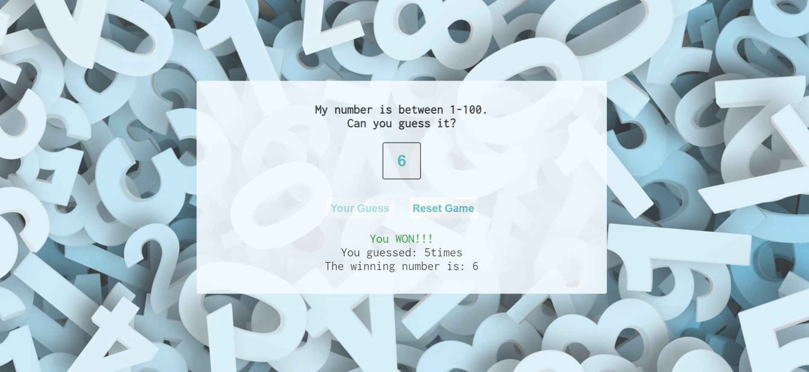

# Guess-the-number

## Description

Guess the Number is a game that challenges the user to guess the correct number up to 10 times. The number must be between 1 and 100. The application shows the number of guesses  and the numbers suggested from the user. If guesses are less than 10 and the correct number is suggested the user wins the game. If the number of guesses goes over 10 without guessing the correct number the user loses the game.

## Screenshots
 

## Links

- Solution URL: [Solution URL here](https://github.com/KodeIva/Guess-the-number)
- Live Site URL: [Live site URL here](https://kodeiva.github.io/Guess-the-number/)

## Technologies used

- HTML5
- CSS 
- JavaScript

###  Codes
- addEventListener()
- Math.random()
- Math.floor()
- push()
- if ... else

## Installation

 N/A

## Credits

N/A

## License
N/A